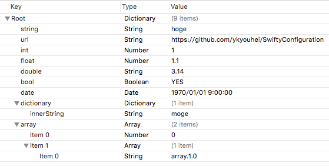

# SwiftyConfiguration

[](https://github.com/Carthage/Carthage)
[](http://cocoadocs.org/docsets/SwiftyConfiguration/)
[](http://cocoadocs.org/docsets/SwiftyConfiguration/)
[](https://github.com/ykyohei/SwiftyConfiguration/blob/master/LICENSE)


SwiftyConfiguration is modern Swift API for Plist.


## Usage

##### 1. Create Plist
create plist file and add your project.



##### 2. Define your plist keys
```Swift
extension Keys {
    static let string      = Key<String>("string")
    static let url         = Key<NSURL>("url")
    static let number      = Key<NSNumber>("number")
    static let int         = Key<Int>("int")
    static let float       = Key<Float>("float")
    static let double      = Key<Double>("double")
    static let date        = Key<NSDate>("date")
    static let bool        = Key<Bool>("bool")
    static let array       = Key<Array<AnyObject>>("array")
    static let dictionary  = Key<[String : String]>("dictionary")
    
    // Support nested value.
    static let innerInt    = Key<Int>("array.0")
    static let innerArray  = Key<String>("array.1.0")
    static let innerString = Key<String>("dictionary.innerString")
}
```

##### 3. Just use it!
```Swift
let plistPath = NSBundle.mainBundle().pathForResource("Configuration", ofType: "plist")!
let config = Configuration(plistPath: plistPath)!

// You can get a plist value to type-safe.
let stringValue      = config.get(.string)!
let urlValue         = config.get(.url)!
let numberValue      = config.get(.number)!
let intValue         = config.get(.int)!
let floatValue       = config.get(.float)!
let doubleValue      = config.get(.double)!
let dateValue        = config.get(.date)!
let boolValue        = config.get(.bool)!
let arrayValue       = config.get(.array)!
let dictionaryValue  = config.get(.dictionary)!
let innerIntValue    = config.get(.innerInt)!
let innerArrayValue  = config.get(.innerArray)!
let innerStringValue = config.get(.innerString)!
```

## Installation

### Carthage
`SwiftyConfiguration` is available through [Carthage](https://github.com/Carthage/Carthage). To install it, simply add the following line to your Cartfile:

```ruby
github "ykyouhei/SwiftyConfiguration"
```

### CocoaPods

`SwiftyConfiguration` is available on CocoaPods.
Add the following to your `Podfile`:

```ruby
pod 'SwiftyConfiguration'
```

### Manually
Just add the Classes folder to your project.
